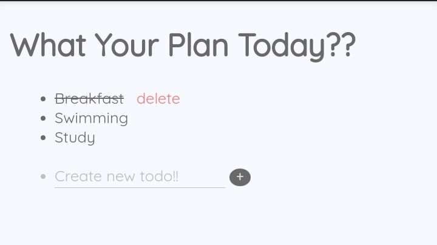

# Todolist
---

_HTML, CSS, and, Javascript simple Todolist_

[NauraFaradisa.github.io/Todolist](https://NauraFaradisa.github.io/Todolist)

## Preview

## Browser Support

|chrome|ie|firefox|safari|opera|
|---|---|---|---|---|
| 4 | 10 | 4 | 3.1 | 11.5 |

## Reference

[https://stackoverflow.com/questions/...](https://stackoverflow.com/questions/2727717/how-to-remove-the-parent-element-using-plain-javascript)

[https://youtu.be/De-pksZy6a0](https://youtu.be/De-pksZy6a0)

[https://codepen.io/chris__sev/pen/IdGKH](https://codepen.io/chris__sev/pen/IdGKH)

[https://caniuse.com/](https://caniuse.com/)

[https://htmlcolorcodes.com/color-names/](https://htmlcolorcodes.com/color-names/)

[https://fonts.google.com/specimen/Quicksand](https://fonts.google.com/specimen/Quicksand)

[https://qastack.id/programming/...](https://qastack.id/programming/155188/trigger-a-button-click-with-javascript-on-the-enter-key-in-a-text-box#)

[https://www.malasngoding.com/...](https://www.malasngoding.com/cara-mengganti-warna-placeholder-dengan-css/)

[https://www.kursuswebsite.org/...](https://www.kursuswebsite.org/cara-membuat-toggle-hideshow-dengan-javascript/)

## About

Author : [Naura Faradisa](https://github.com/NauraFaradisa)

## Tags

[HTML] [CSS] [Javascript]